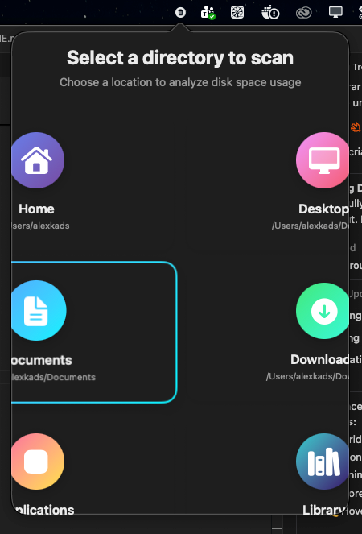
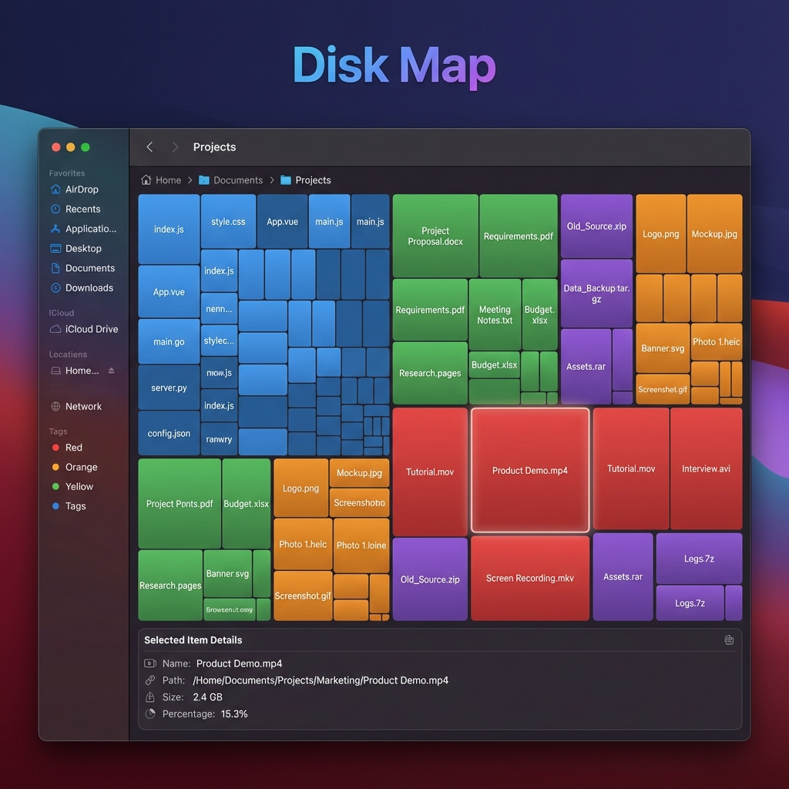
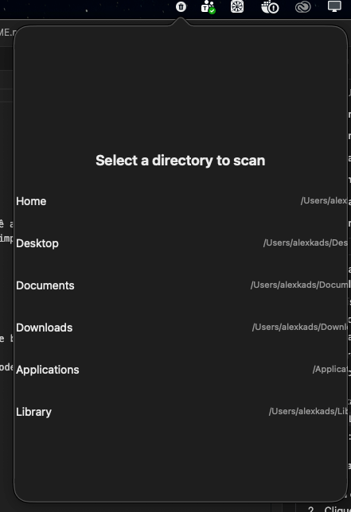

# MAC-LIMPO

<p align="center">
  
  
  
  
</p>

**MAC-LIMPO** é uma aplicação nativa para macOS construída em SwiftUI que ajuda você a liberar espaço em disco de forma rápida e eficiente. A aplicação roda discretamente no menu bar e oferece limpeza poderosa de diversos componentes do sistema, além de visualização avançada de uso de disco com treemap interativo.

## 📸 Screenshots

### Interface Principal


_Interface limpa e moderna no menu bar com cards de categorias de limpeza_

### Disk Map - Visualização Treemap


_Visualização interativa de uso de disco estilo WinDirStat_

### Seleção de Diretórios


_Cards bonitos com gradientes para seleção de diretórios_

## ✨ Funcionalidades

### 🧹 Módulos de Limpeza (22 Categorias)

#### 🛠️ Desenvolvimento

- **🐳 Docker**: Remove containers parados, imagens dangling e build cache
- **📦 Dev Packages**: Limpa caches de npm, pip, brew e cargo
- **⚙️ Xcode Cache**: Limpa DerivedData, Archives, DeviceSupport e previews
- **📱 iOS Simulators**: Remove simuladores antigos (não usados há 90+ dias)
- **💻 IDE Cache**: Limpa caches de JetBrains (Rider, IntelliJ), VS Code, Cursor, Zed, Sublime
- **🤖 Android SDK**: Limpa System Images, AVDs, Gradle cache e build cache
- **🎭 Playwright**: Remove cache de browsers do Playwright
- **🦀 Cargo/Rust**: Limpa cache de build e registry do Cargo
- **🍺 Homebrew**: Limpa cache de downloads do Homebrew
- **📋 Terminal Logs**: Remove logs antigos de terminal (zsh, bash)

#### 💻 Sistema

- **📄 Temp Files**: Remove arquivos temporários e caches do sistema
- **📜 Logs**: Limpa logs antigos do sistema e apps (30+ dias)
- **🗂️ App Cache**: Remove cache de aplicações
- **📥 Old Downloads**: Remove downloads com mais de 30 dias
- **🗑️ Trash Bin**: Esvazia a lixeira

#### 🌐 Navegadores e Apps

- **🌍 Browser Cache**: Limpa caches do Safari, Chrome, Firefox, Edge, Brave e Arc
- **🎵 Spotify Cache**: Remove cache offline do Spotify
- **💼 Slack Cache**: Limpa cache e arquivos temporários do Slack
- **💬 Messaging Apps**: Remove cache de WhatsApp, Teams e Discord
- **🎨 Adobe Cache**: Limpa cache e arquivos de mídia de apps Adobe

#### ✉️ Email e Mensagens

- **📧 Mail Attachments**: Limpa anexos antigos do app Mail
- **💬 Messages Attachments**: Remove anexos antigos do Messages

#### 🔧 System Deep Clean

- **💾 System Data**: Limpeza profunda de caches do sistema, Safari, dados de desenvolvimento e Time Machine snapshots

### 🗺️ Disk Map - Visualização Treemap

- **Treemap Interativo**: Visualização hierárquica estilo WinDirStat
- **Cores por Tipo**: Código (azul), Documentos (verde), Vídeos (vermelho), Imagens (laranja), Arquivos compactados (roxo)
- **Navegação**: Zoom in/out, breadcrumb navigation, botão voltar
- **Janela Separada**: Abre em janela independente, redimensionável e movível
- **Scan Paralelo**: 3-5x mais rápido usando múltiplos cores do processador
- **Progresso em Tempo Real**: Barra de progresso atualizada frequentemente
- **Info Panel**: Detalhes do arquivo/pasta ao passar o mouse

### 🎨 Interface Moderna

- Design vibrante com gradientes coloridos
- Animações suaves e micro-interações
- Tema adaptável (dark/light mode)
- Interface intuitiva no menu bar
- Cards interativos com hover effects
- Glassmorphism e efeitos modernos

### 📊 Estatísticas

- Visualização de espaço em disco usado/disponível
- Estimativa de espaço recuperável por categoria
- Resultados detalhados pós-limpeza
- Tempo de execução das operações
- Análise visual de uso de disco

## 🚀 Como Usar

### Pré-requisitos

- macOS 13.0 (Ventura) ou superior
- Swift 5.9 ou superior

### Instalação via DMG

1. Baixe o arquivo `MAC-LIMPO.dmg`
2. Abra o DMG e arraste o app para Applications
3. Execute o MAC-LIMPO
4. Procure o ícone de lixeira no menu bar

### Compilação Manual

1. Clone este repositório:

```bash
git clone <repository_url>
cd MAC-LIMPO
```

2. Compile e gere o instalador:

```bash
./create_installer.sh
```

3. Ou compile diretamente:

```bash
swift build -c release
swift run
```

### Uso

#### Limpeza de Disco

1. Clique no ícone de lixeira no menu bar
2. Visualize as estimativas de espaço para cada categoria
3. Clique em qualquer card para limpar aquela categoria
4. Ou use "Scan All" para escanear todas as categorias

#### Disk Map

1. Clique no ícone de grid no menu bar
2. Selecione um diretório para escanear (Home, Desktop, Documents, etc.)
3. Aguarde o scan paralelo (muito rápido!)
4. Explore visualmente o uso de espaço
5. Clique em diretórios para navegar
6. Use o botão "Back" para voltar

## ⚙️ Estrutura do Projeto

```
MAC-LIMPO/
├── MACLIMPOApp.swift          # App principal e menu bar
├── Models/
│   ├── CleaningCategory.swift  # Definição de categorias
│   ├── CleaningResult.swift    # Modelos de resultados
│   └── FileNode.swift          # Modelo hierárquico para treemap
├── Services/
│   ├── CleaningService.swift   # Protocolo base
│   ├── DiskMapService.swift    # Scan paralelo de diretórios
│   └── [22 cleaning services]  # Um para cada categoria
├── ViewModels/
│   ├── MenuBarViewModel.swift
│   └── TreemapViewModel.swift  # Estado do treemap
├── Views/
│   ├── MenuBarView.swift       # View principal
│   ├── TreemapWindowView.swift # Janela do Disk Map
│   └── Components/
│       ├── DirectoryCard.swift # Cards bonitos de diretórios
│       └── [outros componentes]
├── Utilities/
│   ├── FileSystemHelper.swift  # Operações de arquivo
│   ├── ShellExecutor.swift     # Execução de comandos
│   └── TreemapLayout.swift     # Algoritmo squarified
└── Assets.xcassets/
```

## ⚠️ Avisos Importantes

1. **Operações Destrutivas**: Esta aplicação remove arquivos permanentemente. Sempre revise o que será removido antes de confirmar.

2. **Permissões**: Algumas operações podem requerer:
   - Full Disk Access
   - Privilégios administrativos (sudo)

3. **Backup**: Recomenda-se ter backups regulares antes de usar ferramentas de limpeza.

4. **Docker**: A limpeza do Docker remove TODOS os containers parados e imagens não utilizadas. Certifique-se de não precisar deles.

## 🛠️ Tecnologias Utilizadas

- **SwiftUI**: Framework de UI moderna da Apple
- **AppKit**: Para integração com menu bar (NSStatusItem)
- **Combine**: Para gerenciamento de estado reativo
- **Foundation**: Para operações de arquivo e sistema
- **Swift Concurrency**: TaskGroup para scan paralelo
- **Canvas**: Renderização eficiente do treemap

## 🎯 Roadmap

### ✅ Implementado (v1.0)

- [x] Interface moderna no menu bar
- [x] 22 categorias de limpeza
- [x] Visualização de espaço em disco
- [x] Resultados detalhados de limpeza
- [x] Disk Map com treemap interativo
- [x] Scan paralelo (3-5x mais rápido)
- [x] Navegação hierárquica no treemap
- [x] Cores por tipo de arquivo
- [x] Janela separada para Disk Map
- [x] Progresso em tempo real
- [x] Botão voltar para navegação

### 🚧 Em Desenvolvimento (v1.1)

- [ ] Agendamento automático de limpeza
- [ ] Notificações quando espaço está baixo
- [ ] Exportação de relatórios de limpeza
- [ ] Atalhos de teclado
- [ ] Preferências avançadas

### 📋 Planejado (v2.0)

- [ ] Exclusão de diretórios específicos da limpeza
- [ ] Análise de duplicatas mais inteligente
- [ ] Sugestões automáticas de limpeza
- [ ] Histórico de limpezas
- [ ] Comparação de scans do Disk Map
- [ ] Exportar treemap como imagem
- [ ] Filtros por tipo de arquivo no treemap
- [ ] Busca de arquivos no treemap
- [ ] Integração com limpeza (deletar direto do treemap)
- [ ] Profundidade de scan configurável
- [ ] Cache de scans anteriores

### 💡 Ideias Futuras

- [ ] Widget para Notification Center
- [ ] Integração com iCloud Drive
- [ ] Análise de uso de rede
- [ ] Monitoramento de apps que consomem espaço
- [ ] Suporte para múltiplos volumes/discos
- [ ] Modo de limpeza agressiva
- [ ] Limpeza de arquivos de log específicos de apps
- [ ] Detecção de arquivos grandes não usados

## 📝 Licença

Este projeto está sob a licença MIT.

## 🤝 Contribuições

Contribuições são muito bem-vindas! Este projeto está aberto para melhorias, correções de bugs, novas features e documentação.

### Como Contribuir

1. **Fork o projeto**

   ```bash
   # Clique em "Fork" no GitHub
   git clone https://github.com/seu-usuario/MAC-LIMPO.git
   cd MAC-LIMPO
   ```

2. **Crie uma branch para sua feature**

   ```bash
   git checkout -b feature/MinhaNovaFeature
   # ou
   git checkout -b fix/CorrecaoDeBug
   ```

3. **Faça suas alterações**
   - Siga os padrões de código do projeto
   - Adicione comentários quando necessário
   - Mantenha o código limpo e legível

4. **Teste suas mudanças**

   ```bash
   swift build
   swift run
   ```

5. **Commit suas mudanças**

   ```bash
   git add .
   git commit -m "feat: adiciona nova funcionalidade X"
   # ou
   git commit -m "fix: corrige bug Y"
   ```

6. **Push para sua branch**

   ```bash
   git push origin feature/MinhaNovaFeature
   ```

7. **Abra um Pull Request**
   - Descreva claramente o que foi alterado
   - Referencie issues relacionadas
   - Adicione screenshots se aplicável

### Padrões de Código

- **Swift Style Guide**: Siga as convenções do Swift
- **SwiftUI**: Use componentes reutilizáveis
- **Nomenclatura**: Use nomes descritivos em inglês
- **Comentários**: Documente funções complexas
- **Formatação**: Use 4 espaços para indentação

### Tipos de Contribuição

#### 🐛 Reportar Bugs

- Use o template de issue para bugs
- Descreva o comportamento esperado vs atual
- Inclua passos para reproduzir
- Adicione screenshots se possível

#### ✨ Sugerir Features

- Use o template de issue para features
- Explique o problema que resolve
- Descreva a solução proposta
- Considere alternativas

#### 📝 Melhorar Documentação

- Corrija erros de digitação
- Adicione exemplos
- Melhore explicações
- Traduza para outros idiomas

#### 🧹 Adicionar Novos Serviços de Limpeza

1. Crie um novo arquivo em `Services/`
2. Implemente o protocolo `CleaningService`
3. Adicione a categoria em `CleaningCategory.swift`
4. Registre o serviço em `MenuBarViewModel.swift`
5. Teste extensivamente antes de submeter

### Áreas que Precisam de Ajuda

- [ ] Testes unitários e de integração
- [ ] Localização (i18n) para outros idiomas
- [ ] Otimização de performance
- [ ] Documentação de código
- [ ] Novos serviços de limpeza
- [ ] Melhorias na UI/UX

### Código de Conduta

- Seja respeitoso e inclusivo
- Aceite críticas construtivas
- Foque no que é melhor para a comunidade
- Mostre empatia com outros contribuidores

### 📋 Changelog

Todas as mudanças são documentadas no [CHANGELOG.md](CHANGELOG.md). Ao contribuir, adicione suas mudanças na seção `[Unreleased]`.

Para mais detalhes, veja [CONTRIBUTING.md](CONTRIBUTING.md).

## 👨‍💻 Autor

Desenvolvido com ❤️ usando SwiftUI

---

**⚡ Libere espaço, ganhe performance!**
