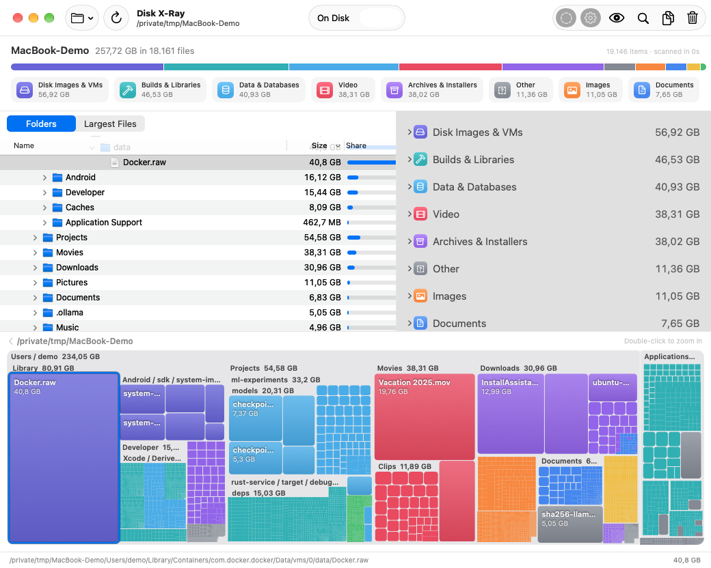
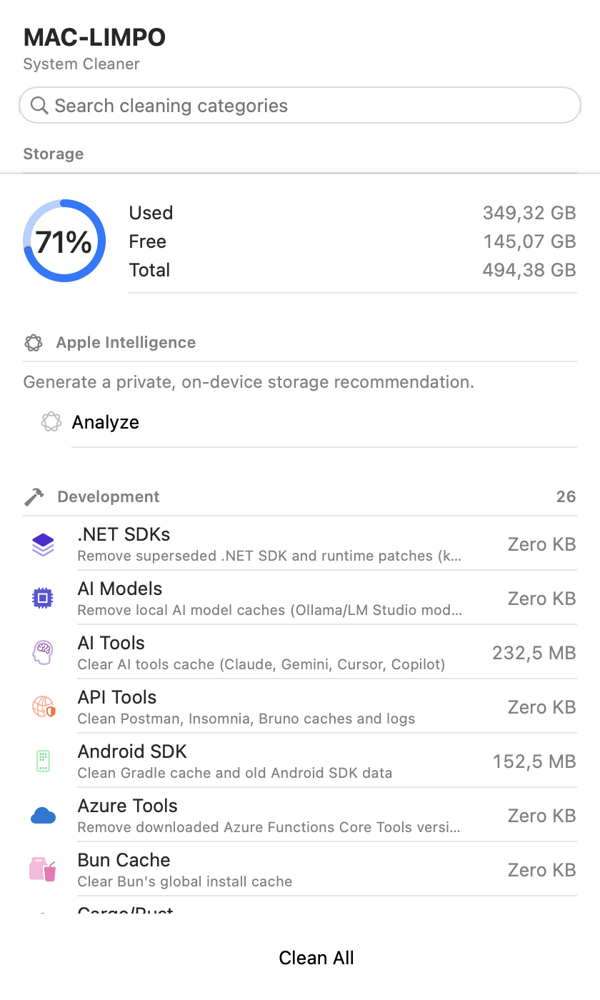
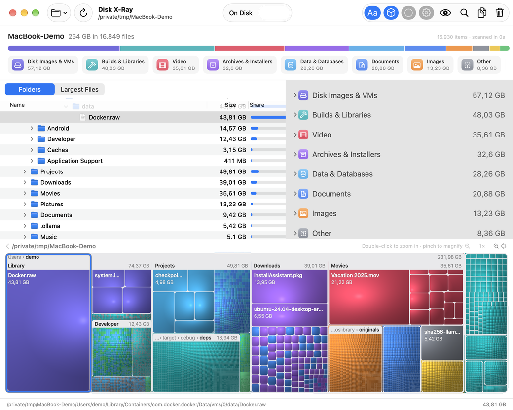

<div align="center">

# MAC-LIMPO

**Free up disk space on your Mac — a native menu bar cleaner for developers, with a disk X-ray that shows where every gigabyte goes.**

[](LICENSE)
[](https://alexkads.github.io/MAC-LIMPO/install/)
[](https://swift.org)
[](https://github.com/alexkads/MAC-LIMPO/releases/latest)
[](https://alexkads.github.io/MAC-LIMPO/)

[Website](https://alexkads.github.io/MAC-LIMPO/) · [Install](#install) · [Features](#features) · [Contributing](CONTRIBUTING.md) · [Português](README.pt-BR.md)



</div>

## Why

Xcode, Docker, simulators, `node_modules`, Rust `target/` folders, package caches and AI models quietly eat hundreds of gigabytes. MAC-LIMPO finds them, tells you how much each one takes, and cleans them — moving files to the Trash whenever possible so a cleanup can be undone.

It is a native SwiftUI + AppKit app that lives in the menu bar. No telemetry, no account, no subscription.

## Install

### One command (recommended)

```bash
curl -fsSL https://alexkads.github.io/MAC-LIMPO/install.sh | sh
```

The script checks your Mac, downloads the source of the latest release, **builds it on your machine** and installs `MAC-LIMPO.app` into `/Applications`. Because the app is compiled locally it never carries the quarantine flag, so it opens on the first click — no Developer ID certificate needed, no Gatekeeper warning. [Read the script](docs/install.sh) before running it if you like.

Requirements: **macOS 27 or later** and the **Command Line Tools** (`xcode-select --install`) or Xcode, with Swift 6.4. The first build takes 2–5 minutes.

```bash
# Options: build a branch, choose the folder, preview, or uninstall
curl -fsSL https://alexkads.github.io/MAC-LIMPO/install.sh | sh -s -- --version main
curl -fsSL https://alexkads.github.io/MAC-LIMPO/install.sh | sh -s -- --dest ~/Applications
curl -fsSL https://alexkads.github.io/MAC-LIMPO/install.sh | sh -s -- --dry-run
curl -fsSL https://alexkads.github.io/MAC-LIMPO/install.sh | sh -s -- --uninstall
```

### Installer package

Each [release](https://github.com/alexkads/MAC-LIMPO/releases/latest) ships a `.pkg`. It is not notarized, so after downloading, right-click it and choose **Open**.

### From source / Xcode

```bash
git clone https://github.com/alexkads/MAC-LIMPO.git
cd MAC-LIMPO
swift run                 # build and launch (look for the icon in the menu bar)
open Package.swift        # or open the project in Xcode 27 and press ⌘R
make app                  # assemble build/app/MAC-LIMPO.app
```

More in the [installation guide](https://alexkads.github.io/MAC-LIMPO/install/).

## Features



**46 cleaning categories**, grouped and measured before anything is removed:

- **Development** — Xcode DerivedData and archives, iOS simulators, Docker images/build cache, `node_modules`, Rust `target/`, Cargo, Go, pnpm, Bun, npm/pip, NuGet, Dart/Flutter pub, Android SDK, .NET SDKs, old Node versions (nvm), IDE caches (VS Code, Cursor, JetBrains, Zed), Playwright, Cypress, Expo, local AI models.
- **System** — logs, temporary files, `/var/folders`, app caches, Trash, System Data.
- **Apps & browsers** — Safari/Chrome/Firefox caches, Spotify, Adobe, Notion, creative apps, leftovers of uninstalled apps.
- **Communication** — Slack, Messages and Mail attachments, WhatsApp/Teams/Discord caches.

**Disk X-Ray** — a full map of the disk: every file read in seconds (millions of items), a treemap colored by file type, a folder tree, a file-type panel and the largest files. Pinch (or scroll the mouse wheel) to magnify down to a single 1 KB file and drag to pan, like a map; ⌘↩ flies to the selected item. Switch to the **3D map**, drawn on the GPU with Metal as lit cushions where folders show as creases. Double-click to zoom into a folder, Quick Look, Show in Finder, Move to Trash.



**Safe by default** — scan first, confirm before cleaning, Trash instead of delete where possible, and caches only (never your documents). See [what it cleans and why it is safe](https://alexkads.github.io/MAC-LIMPO/safety/).

**Native look** — the default *Liquid Glass* theme uses only system components; Classic, Cyberpunk and Matrix themes are one click away. Apple Intelligence can write an on-device storage recommendation, and App Intents expose cleaning to Shortcuts and Siri.

<br clear="right">

## Contributing

Contributions are welcome — new cleaning categories especially. Read [CONTRIBUTING.md](CONTRIBUTING.md), the [Code of Conduct](CODE_OF_CONDUCT.md) and the [development guide](https://alexkads.github.io/MAC-LIMPO/development/). Security issues: see [SECURITY.md](SECURITY.md).

## License

MAC-LIMPO is free software, released under the [GNU General Public License v3.0 or later](LICENSE). See [NOTICE](NOTICE) for acknowledgements — the Disk X-Ray is inspired by [WinDirStat](https://github.com/windirstat/windirstat).

Copyright © 2025-2026 Alex S S Fonseca and contributors.
